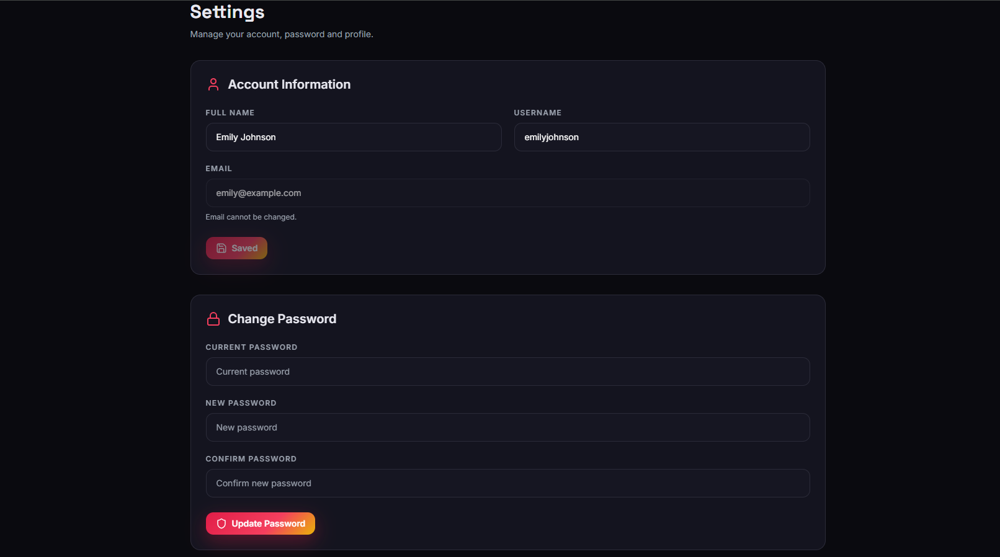

# 🎬 Streamix


A Full Stack MERN Video Streaming Platform inspired by YouTube with secure authentication, video uploads, subscriptions, playlists, comments, likes, search, trending videos, watch history, and creator dashboard.

---

## 🚀 Live Demo

Frontend: https://streamix-frontend-beta.vercel.app

Backend API: https://streamix-backend-y8ib.onrender.com

---

## 📸 Screenshots

### Home


### Watch Video


### Dashboard


### Upload


### Profile


### Setting


---

# ✨ Features

### 👤 Authentication
- User Registration
- User Login
- JWT Authentication
- Access & Refresh Token
- Secure Cookies
- Logout

### 🎥 Video
- Upload Video
- Watch Video
- Edit Video
- Delete Video
- Publish / Unpublish
- View Count
- Categories
- Trending Videos

### ❤️ Social Features
- Like / Unlike Videos
- Subscribe / Unsubscribe Channels
- Comments
- Comment CRUD
- User Profiles

### 📂 Library
- Watch History
- Playlists
- Liked Videos
- Your Videos

### 🔍 Search
- Search by Title
- Search by Description
- Search by Channel
- Category Filter

### 📊 Creator Dashboard
- Uploaded Videos
- Video Management
- Dashboard

### 🎨 UI
- Responsive Design
- Premium Dark Theme
- Mobile Friendly
- Modern UI
- Redux State Management

---

# 🛠 Tech Stack

## Frontend

- React.js
- Vite
- Redux Toolkit
- React Router DOM
- Axios
- React Hook Form
- Tailwind CSS
- Lucide React
- React Hot Toast

## Backend

- Node.js
- Express.js
- MongoDB
- Mongoose
- JWT
- Cloudinary
- Multer
- Cookie Parser
- CORS
- dotenv

---

# 📂 Project Structure

```
Streamix/
│
├── Streamix-Frontend/
│
└── Streamix-Backend/
```

---

# ⚙️ Installation

## Clone Repository

```bash
git clone https://github.com/mananpatel17106-web/Streamix-Frontend.git
```

---

## Frontend

```bash
cd Streamix-Frontend
npm install
npm run dev
```

---

# 🔐 Environment Variables

Create `.env`

```env
VITE_API_BASE_URL=
```

---

# 📦 Build

Frontend

```bash
npm run build
```

Backend

```bash
npm start
```

---

# 📱 Pages

- Home
- Login
- Signup
- Watch Video
- Upload Video
- Dashboard
- Profile
- Playlists
- History
- Subscriptions
- Settings
- Search

---

# 🔒 Security

- JWT Authentication
- Protected Routes
- Secure Cookies
- Password Hashing
- Input Validation
- MongoDB Sanitization

---

# 🎯 Future Improvements

- Live Streaming
- Video Recommendations
- Notifications
- Real-Time Chat
- Dark/Light Theme
- Admin Panel
- Analytics

---

# 👨‍💻 Author

**Manan Patel**

Computer Science & Engineering Student

GitHub: https://github.com/mananpatel17106-web

---

# ⭐ Support

If you like this project, give it a ⭐ on GitHub.

---

# 📜 License

This project is developed for learning, portfolio, and educational purposes.